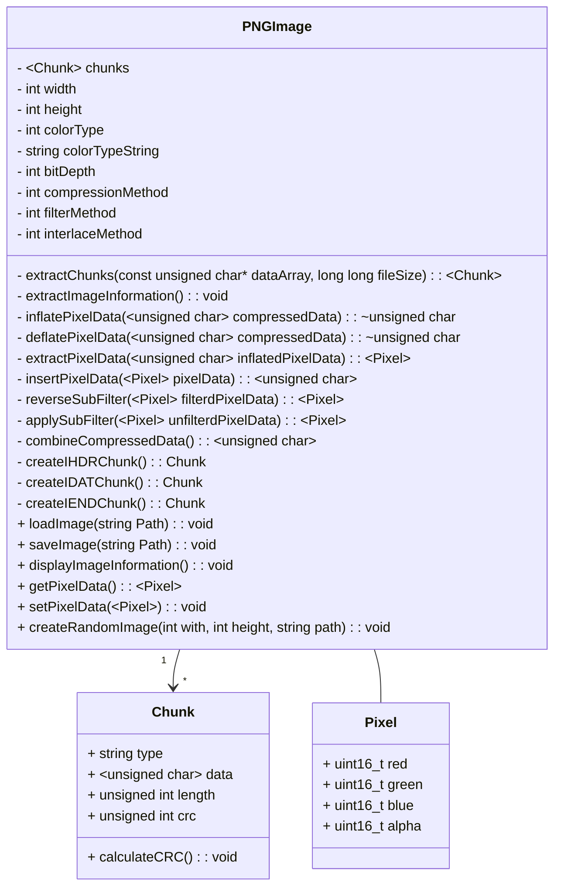
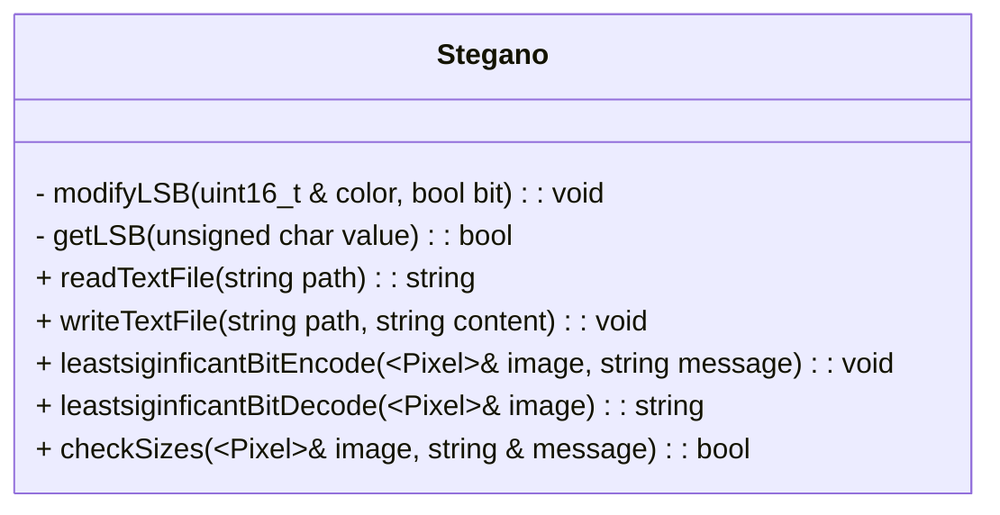

# Aufgabenstellung
Ein Konsolenprogramm zum Verstecken von Nachrichten in Textform in Bilddateien, ohne das äußere Erscheinungsbild und die Signatur des Bildes fundamental zu ändern. Die Änderung soll hierbei so gering sein, wie es der Umfang der Nachricht zulässt.

Vorerst wird sich auf Textnachrichten im *.txt* Format und Bilder im *PNG* Format beschränkt. Vorbehalten wird sich weitere Formate und Datenarten hinzuzufügen (Bsp eine Kodierung eines Bildes im Bild). Der Fokus des Algorithmus soll auf der Geringhaltung der direkt sichtbaren, äußeren Änderungen am Bild liegen. Nebensächlich aber trotzdem Betrachtet werden sollen Änderungen die durch einfache Analyse der Rasterdaten des Bildes entdeckt werden könnten. Hierzu zählt beispielsweise ein Histogramm.

>Warum PNG?
>Aufgrund der Verlustfreien Komprimierung geht der Inhalt der Nachrichten nicht verloren.

# Vorwort
Aufgrund diverser Probleme im ersten Anlauf der Projektumsetzung die sich in größten Teilen auf die Installation von externen Library bezogen, musste das Projekt neu strukturiert werden. Deshalb wurde nun mit möglichst wenigen Externen Librarys geaarbeitet. Hieraus resultiert, dass der Prozess des Einlesens einer PNG Datei zu einem Kernproblem des Projektes wurde.
# Problemstellungen
## Einlesen einer PNG Datei
### Einschub: Aufbau einer PNG 
Quellen:
[Portable Network Graphics (PNG) Volker Krause Technische Hochschule Aachen](http://www-i4.informatik.rwth-aachen.de/content/teaching/proseminars/sub/2002_2003_ws_docs/png.pdf)
[PNG (Portable Network Graphics) Specification W3C Recommendation 01-October-1996](https://www.w3.org/TR/PNG-Introduction.html)

Die ersten 8 Byte einer PNG Datei sind die bereits erwähnte **Magic Number** also folgende Zahlenfolge im Dezimalsystem: 137, 80, 78, 71, 13, 10, 26, 10. An dieser lässt sich eine PNG Datei erkennen. Weiterhin besteht eine PNG Datei aus sogenannten Chunks.
## Chunks
Die Chunks sind einzelne Datenblöcke mit unterschiedlichen Funktionen. Der Aufbau dieser Datenblöcke ist wie folgt:

| Größe  | Bedeutung             |
|--------|-----------------------|
| 4 byte | Länge des Datenblocks |
| 4 byte | Chunk-Typ             |
| n byte | Datenblock            |
| 4 byte | Prüfsumme             |

Wichtig zu beachten ist das die ersten Bytes die Länge des Datenblocks beschreiben und nicht die des gesamten Chunks. Der Chunk-Typ ist in ASCII codiert Hierbei besitzt das 5 Bit des ersten Bytes (also des ersten Buchstabens) eine besondere Bedeutung, Dieses Bit unterscheidet in ASCII die Groß- und Kleinschreibung und wird im PNG Format als `Ancillary bit` genutzt. Es zeigt also an ob der entsprechende Chunk kritische Daten des Bildes enthält, die nicht weggelassen werden können. Der Chunk-Typ von essentiellen Chunks beginnt somit mit einem Großbuchstaben. Der Datenblock enthält die spezifischen Daten der Chunks und unterscheidet sich je nach Chunk-Typ. Hierzu später mehr. Aus Datenblock und Chunk-Typ wird anschließend eine CRC Prüfsumme (Cyclic Redundancy Check) gebildet die in den letzten 4 byte des Chunks gespeichert wird.

### Chunktypen
#### IHDR
Der `IHDR` Chunk ist der erste Chunk einer PNG Datei und enthält alle Metadaten des Bildes:

| Byte  | Bedeutung            |
|-------|----------------------|
| 0 - 3 | Breite der Bildes    |
| 4 - 7 | Höhe des Bildes      |
| 8     | Bits pro Pixel       |
| 9     | Farbtyp              |
| 10    | Kompressions-Methode |
| 11    | Filter-Methode       |
| 12    | Interlace-Methode    |

Die Bytes 0-8 sind selbsterklärend und beschreiben Breite, Höhe und die Anzahl an Bytes pro Pixel. Die verfügbaren Farbtypen zeichnen sich wie folgt aus:

| Farbtyp | Bedeutung                      | Erlaubte Bits pro Pixel |
|---------|--------------------------------|-------------------------|
| 0       | Graustufenbild                 | 1,2,4,8,16              |
| 2       | Farbbild                       | 8,16                    |
| 3       | Indiziertes Farbbild           | 1,2,4,8                 |
| 4       | Graustufenbild mit Alpha-Kanal | 8,16                    |
| 6       | Farbbild mit Alpha-Kanal       | 8,16                    |

Sowohl die Kompressions-Methode als auch die Filter-Methode sind aktuell immer auf 0 gesetzt, da für beide nur jeweils ein Typ unterstützt wird. Als Kompressions-Methode wird `deflate/inflate` Kompression eingesetzt. Für die Filter-Methode wird `adaptive filtering` eingesetzt welches jedoch selbst fünf Filtertypen beinhaltet. Hierzu später mehr. Für die Interlace-Methode steht 0 für keinen Interlace und 1 für `Adam7` Interlace.

#### IEND
Der `IEND` Chunk makiert das Ende der Datei und besitzt keine Daten.
#### IDATA
Der `IDAT` Chunk enthält die eigentlichen Bilddaten was dazu führt das jede gültige PNG mindestens einen `IDAT` Chunk besitzen muss. Die Bilddaten können aber auch auf mehrere Daten-Chunks aufgeteilt werden. Jedoch müssen diese in der richtigen Reinfolge aufeinanderfolgen, damit das Bild korrekt dargestellt wird.
Die Daten innerhalb der Chunks sind komprimiert und gefiltert. Zur Komprimierung wird die [deflate/inflate Kompression](https://www.w3.org/TR/PNG-Compression.html) genutzt. Diese wird jedoch auf die gesamten Daten und nicht auf jeden einzelnen Chunk angewendet. Zusätzlich werden die Pixelwerte noch gefiltert wobei `adaptive Filtering` eingesetzt wird. Adaptive Filtering besitzt verschiedene Filtermethoden, welche im ersten Bit in jeder Bild-Zeile definiert werden:

| Typ | Name                    |
|-----|-------------------------|
| 0   | Keine Filterung         |
| 1   | Sub Filterung           |
| 2   | Up Filterung            |
| 3   | Durchschnitts Filterung |
| 4   | Paeth Filterung         |

Mehr zu den einzelnen Filtertypen [hier](https://www.w3.org/TR/PNG-Filters.html)

#### Weitere
##### PLTE
Um indizierte Bilder darstellen zu können wird der `PLTE` Chunk benötigt der 256 Paletteneinträge (da je ein byte genutzt wird um auf den Eintrag zu referenzieren) enthalten kann. Diese bestehen dann jeweils aus drei Werten für Rot, Grün, Blau Farbwerte.
##### Ancillary chunks
Diese Chunks sind optional. Beispiele sind `bKGD` zur Definition einer Hintergrundfarbe, `gAMA` um den Gamma Wert einer Kamera zu speichern oder auch das ablegen von Texten mit ` tEXt`

## Übersicht
Aufbau einer 3x3 PNGs:


Beispiel für dekomprimierte Pixel Daten aus einem `IDAT` Chunk:

### Auslesen der einzelnen Chunks
Um PNG Bilder korrekt einzulesen wurde sich an der Struktur dieser orientiert:


Ein PNG Bild besteht aus einer Vielzahl von Chunks die in eine Liste von Chunk Objekten eingelesen werden. Da ein Chunk immer aus den gleichen drei Bestandteilen besteht lässt sich dieser entsprechend gut als eigene Klasse umsetzen.
Mit Hilfe von Bit-Shifting können die einzelnen Parameter der Chunks extrahiert werden:
```c++
chunk.length = dataArray[arrayIndex] << 24 | dataArray[arrayIndex + 1] << 16 | dataArray[arrayIndex + 2] << 8 | dataArray[arrayIndex + 3];
```

Vor dem laden der einzelnen Chunks wird ebenfalls die sogenannte Magic Number überprüft:
```c++
if (dataArray[0] != 137 || dataArray[1] != 80 || dataArray[2] != 78 || dataArray[3] != 71 || dataArray[4] != 13 || dataArray[5] != 10 || dataArray[6] != 26 || dataArray[7] != 10) {  
std::cerr << "Error: File is not a PNG image" << std::endl;
```

### Auslesen der Chunk Daten
Anschließend können die einzelnen Chunks ausgelesen werden. Relevant sind hierbei der `IHDR` Chunk und der `IDAT` Chunk. Im Header Chunk befinden sich alle Metadaten des Bildes die aufgrund der festen Struktur ebenfalls mit Bit-Operationen extrahiert werden können und so Höhe, Breite und weiters liefern.
Um die Daten des `IDAT` Chunks auszulesen müssen sie zuerst dekomprimiert werden. Hierzu kam die *Z-Library* zu Einsatz, die entsprechende `inflate` und `deflate` Algorithmen liefert. Auf die dekomprimierten Daten musste kann jetzt der jeweilige Filter angewandt werden. Bei der Implementierung wurde sich auf *Truecolor-Images* und den *Sub-Filter* beschränkt. Der Sub-Filter speichert statt den eigentlichen Pixel Werten immer nur die Differenz zum vorherigen Pixel:
$$P´_x=P_x-P_{x-1} $$
Um die eigentlichen RGB-Werte zu erhalten muss der Filter entsprechend umgekehrt werden:
$$P_x=(P´_x+P´_{x-1})\bmod 256 $$
Ebenfalls muss das jeweilige Filter-byte am Anfang jeder Bildzeile entfernt werden, welches den Filtertyp beschreibt.
### Erstellen eigener Chunks
Ein eigener `IHDR` Chunk kann aus den Bildinformationen zusammengesetzt werden, muss aber immer upgedatet werden wenn die Pixeldaten gesetzt werden, sodass Höhe und Breite des Bildes korrekt abgegeben werden.
Um einen `IDAT`Chunk zu erstellen müssen die oben genannten Prozesse umgekehrt werden. Ein wichtiger Aspekt jedes Chunks ist die *CRC Prüfsumme* die nach jeder Änderung en einem Chunk neu berechnet werden muss. Hierzu wurde ebenfalls ein Algorithmus aus der *Z-Library* eingesetzt.
Nachdem alle benötigten Chunks erstellt wurden können diese bitweise in eine Datei geschrieben werden um so eine gültige PNG Datei zu erzeugen.

## Generieren von zufälligen Pixeldaten
Um zu überprüfen, ob sich gültige PNG Dateien erzeugen lassen wurde eine Methode implementiert die zufällige Farbwerte generiert und diese als ein PNG Bild abspeichert.

*Ein Bild mit zufälligen Farbwerten der Größe 2000x2000 Pixel*


## Steganographie von Textdokumenten im PNG Bild
### Einschub Steganographie

> AI: Was ist Steganographie?
>
> Steganographie ist die Kunst oder Technik, versteckte Informationen in anderen Daten oder Medien zu verbergen, ohne dass der Empfänger dies bemerkt. Die Informationen können in verschiedenen Formen wie Bildern, Videos, Audiodateien oder Texten versteckt werden. Steganographie wird häufig verwendet, um geheime Nachrichten zu übermitteln oder digitale Spuren zu verwischen. Es gibt viele Methoden und Algorithmen für die Steganographie, einschließlich der Verwendung von Least Significant Bit (LSB) -Techniken und der Verwendung von kryptografischen Verschlüsselungsalgorithmen.

Die Steganographie ist das verstecken von Informationen in Daten oder Medien, ohne das dritte Individuen dies erkennen. Hierzu können Bilder, Videos etc dienen.

>Quote:
> 
>Steganography is the art of hiding the fact that communication is taking place, by hiding information in other information. (Morkel et al., 2005)^[Morkel, T., Eloff, J. H. P. & Olivier, M. (2005). An overview of image steganography. In _Information Security for South Africa_ (S. 1–11). https://martinolivier.com/open/stegoverview.pdf]


Wichtig ist die Steganographie von der Kryptographie abzugrenzen. In der Steganographie wird die Existenz einer Nachricht versteckt und nicht ihren Inhalt. Hiermit wird also keine sichere verschlüsselte Kommunikation gewährleistet.

>Quote:
> 
>„Es darf nicht der Geheimhaltung bedürfen und soll ohne Schaden in Feindeshand fallen können.“
>– Auguste Kerckhoffs: La cryptographie militaire 1883

Eine Kombination von Steganographie und Kryptographie ist also sinnvoll wenn Kommunikation versteckt und sicher stattfinden soll.
Weiter Use-Cases für Steganographie sind das Watermarking und Fingerprinting, um Daten Identifizierbar zu machen. So kann beispielsweise intellektuelles Eigentum geschützt werden.


### Least Significant Bit Steganographie
Um anschließend dennoch die eigentliche Aufgabenstellung der Steganographie umzusetzen, wurde sich auf eine sehr einfache Form beschränkt.
#### Einschub Least Significant Bit Steganographie
Das letzte Bit eines Pixel bzw eines Pixelwerts bei mehrkanaligen Bildern wir verwendet um die Nachricht zu Speichern. So können in einem Grauwertbild welches 8 Bit nutzt $Laenge*Breite$
An Bits gespeichert werden. Bei einer 3-Kanaligen RGB Bild können $Länge*Breite*3$ Bits gespeichert werden. Ein 400x400 Pixel Bild kann somit $400*400*3=480000\text{Bits}$ speichern. Geht man hierbei davon aus das ASCII Zeichen kodiert werden sollen kann eine Nachricht mit  $\frac{480000}{8}=60000$ Zeichen gespeichert werden. Dies geht davon aus das ein ASCII Zeichen 8 Bits benötigt. Wenn der Zeichensatz reduziert wird kann damit auch die Nachrichtenlänge erhöht werden.
Dieser Ansatz ist aufgrund seiner simplen Art auch entsprechend einfach zu identifizieren.

#### Umsetzung
Um die Least Significant Bit Steganographie umzusetzen wurde eine weitere Klasse implementiert die nötigen Methoden bereitstellt.

Um die Nachricht im letzten Bit der Farbwerte zu verstecken wird jeder Pixel durchgegangen und der jeweilige Farbwert im letzten Bit zum aktuellen Bit der Nachricht geändert. Das ende er Nachricht wird im Bild durch einen *End-of-file* Ascii Wert (`eof`=`\26`) vermerkt. Um die Nachricht zu dekodieren werden die Bilddaten bis zu diesem Zeichen durchlaufen und die Letzten Bits jeweils extrahiert, um so die Nachricht zu erhalten.

# Probleme
## Erster encoding Versuch
**Startbild:**
Codiert werden sollte ein Dummy Text der mit Hilfe von [Lorem Ipsum](https://www.loremipsum.de/) generiert wurde.

**Ergebnis**

Obwohl das Bild optisch nicht dem Ursprungsbild entspricht, konnte die Nachricht korrekt decodiert werden. Der Fehler wird im Aufbau der Pixeldaten vermutet, da dies Ursprünglich in mehrere `IDAT` Chunks aufgeteilt waren. Das Ergebnisbild wurde jedoch in einem `IDAT`Chunk gespeichert